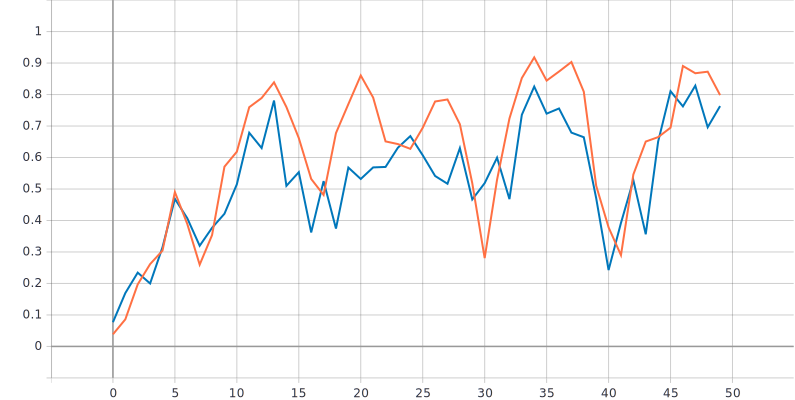
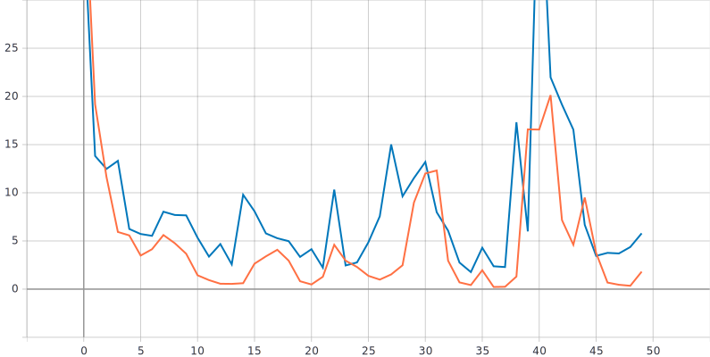
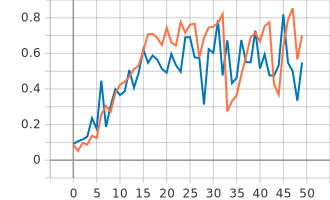
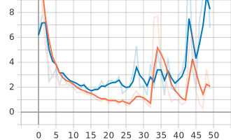

Лабораторная работа #1.
====
Подготовка окружения для решения задачи классификации изображений из набора
данных Oregon Wildlife с использованием нейронных сетей глубокого обучения
-----

С данной лабораторной работе мы использовали набор данных Oregon Wildlife, включающий в себя набор изображенй в размере 14.000, который необходимо классифицировать по таким категориям как: 

Для решения этой задачи классификации использовалась двумерная (2D) СНС (Свёрточная нейронная сеть) ,  с количеством эпох(epoch - весь набо данных прошел через нейронную сеть только один раз) = 50, поскольку 1 эпоха слишком велика для компьютера ее делят на партии (batches), в нашем случае batch_size = 512 изображений. 

**Две основные концепции в свёрточных нейронных сетях:**

1.Свёртка 

2.Операция подвыборки 

1)***Свёртка*** - математическая операция, суть который заключается в том, что (в нашем случае двумерные матрицы используются) есть ядро свертки и есть входное изображение, ядром свертки мы перемещаемся по изображению сначала по-горизонтали, а потом по-вертикали с шагом 1 пиксель, в нашем случае ядро свертки это матрица 3х3, при каждом перемещении ядро перемножается с соответсвтующими элементами входного изображения, после чего суммируем произведения в 1 выходной пиксель. Со старта обучения матрица свертки заполнена случайными числами, с каждой эпохой матрица заполняется более подходящими числами для решения конкретной задачи.  
**Метод для создания сверточного слоя:**  
 ```
 x = tf.keras.layers.Conv2D(filters=8, kernel_size=3)(inputs)
 ```
2)***Операция подвыборки*** - процесс сжатия изображения путём сложения значений блоков пикселей. Две основные составляющие подвыборки - размер выборки(прямоугольная сетка) и размер шага. Когда эти значения определили, необходимо найти максимальное значение пикселя, из тех, что попадают в область размера выборки, после того, как мы нашли это значение, оно переносится на выходное изображение, а далее сетка сдвигается на размер шага вправо и действия повторяются. В результате получается уменьшенное изображение, уменьшение которого зависит от размера выборки и шага. 
**Метод для создания слоя подвыборки:**
```
x = tf.keras.layers.MaxPool2D()(x)
```  
Описание архитектуры нейронной сети:
----

```
inputs = tf.keras.Input(shape=(RESIZE_TO, RESIZE_TO, 3)) //размер входного изображения 224х224х3
```
**Слой 2D свертки с параметрами: количество фильтров = 8(количество выходных фильтров в свертке), kernel_size = 3(размер матрицы свертки, у нас 3х3) Слой создает ядро свертки.**
```
 x = tf.keras.layers.Conv2D(filters=8, kernel_size=3)(inputs) //размер 222х222х8
 ```
 **Операция максимальной подвыборки, поскольку параметры не указаны, то используются параметры по-умолчанию:pool_size(размер прямоугльной сетки) = 2х2, strides(шаг) = 2.**
 ```
 x = tf.keras.layers.MaxPool2D()(x) //размер 111х111х8
 ```
 **Преобразовывает многомерную матрицу в одномерную**
 ```
 x = tf.keras.layers.Flatten()(x) //размер 111*111*8 = 98568
 ```
 **Полносвязный слой, реализующий операцию output c функцией активации softmax(представления категориального распределения по меткам классов и получения вероятностей)**
 ```
 outputs = tf.keras.layers.Dense(NUM_CLASSES, activation=tf.keras.activations.softmax)(x)
 ```
 Графики обучения для нейронной сети с одним сверточным слоем:
 ----
 
 ***Линейная диаграмма точности:*** 
 
 ***Линейная диаграмма потерь:*** 
 
 
 ***Анализ результатов:***
 На графиках можно наблюдать переобучение так как значение функции потерь на валидационном наборе данных выше, чем значение функции потерь на обучающем наборе данных, причиной этому может служить отсутствие нормальных условий и в тысячи раз больше больше данных для начальных случайных приближений.
 
 
 Графики обучения для нейронной сети с >3 сверточных слоев:
 ----
 ***Для данной задачи в коде были изменены:***
 * Добавленны 3 сверточных слоя Canv2D В которых параметры были изменены следующий образом: для первого слоя количество filtrov = 8 осталось, а для последующих + 8, был добавлен параметр "padding = 'same'" влияет на размерность выхода слоя. Значение 'same' означает, что, при условии сверточного слоя с шагом = 1, размеры изображений выхода и входа совпадут.
 * Добавленны 3 слоя подвыборки MaxPool2D в которых параметры были изменены следующий образом: размер выборки выставлен тот же, что и по-умолчанию, strides(шаг) = (2,1), что значит размер шага по-вертикали = 2, размер шага по-горизотали = 1;
 ```
 x = tf.keras.layers.Conv2D(filters=8, kernel_size=3, padding = 'same')(inputs) //размер 224х224х8
  x = tf.keras.layers.MaxPool2D((2,2),strides = (2,1))(x) // размер 112х223х16
  x = tf.keras.layers.Conv2D(filters=16, kernel_size=3, padding = 'same')(x) 
  x = tf.keras.layers.MaxPool2D((2,2),strides = (2,1))(x) // размер 56х222х24
  x = tf.keras.layers.Conv2D(filters=24, kernel_size=3, padding = 'same')(x) 
  x = tf.keras.layers.MaxPool2D((2,2),strides = (2,1))(x) // размер 28х221х32
  x = tf.keras.layers.Conv2D(filters=32, kernel_size=3, padding = 'same')(x) 
  x = tf.keras.layers.MaxPool2D((2,2),strides = (2,1))(x) // размер 14х220х32
  x = tf.keras.layers.Flatten()(x) //размер 14*220*32 = 98560
  outputs = tf.keras.layers.Dense(NUM_CLASSES, activation=tf.keras.activations.softmax)(x)
  ```
 
  ***Линейная диаграмма точности:*** 
 
 ***Линейная диаграмма потерь:*** 
 
 
  ***Анализ результатов:***
  На этих графиках еще большие потери в связи с тем, что, помимо вышеописанных проблем, неправильно подобран шаг в MaxPool2D в связи с чем изображение по-горизонтали почти не изменяет размеров, а вот в случае с вертикалью - очень сильно сжимается.


 
 
 


